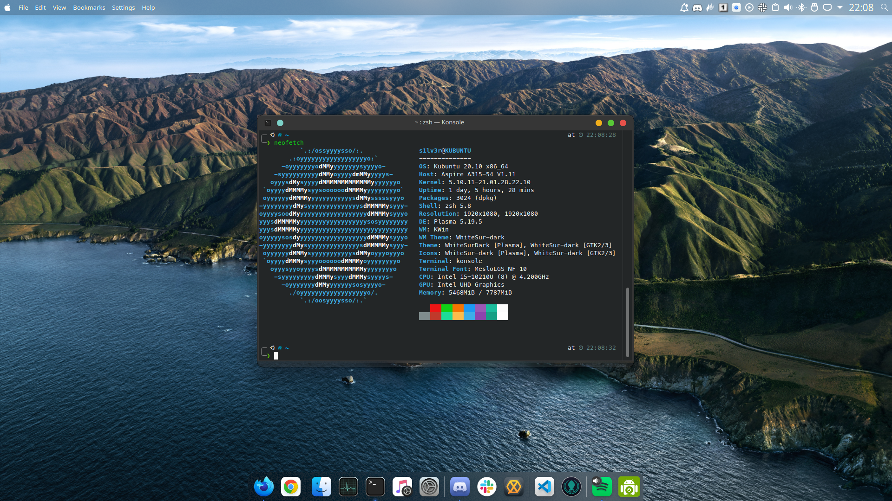

# Dotfiles

These are the dotfiles i chose to keep between my linux installs. Nothing really special about them.

## Screenshot



## Requirements

The dotfiles themselves don't have any requirements other than to have their
respective programs installed. For example `vim` for [`vimrc`](./vimrc).

Uses chezmoi for dotfile management.

## Cloning and installing

```bash
# If you already have chezmoi installed
# NOTE: May overwrite already existing dotfiles
chezmoi init --apply theS1LV3R

# If chezmoi is not installed
# NOTE: May overwrite already existing dotfiles
# NOTE: May install itself to $HOME/.local/bin/chezmoi
sh -c "$(curl -fsLS git.io/chezmoi)" -- init --apply theS1LV3R
```

## License

MIT license. See [`./LICENSE`](./LICENSE)
